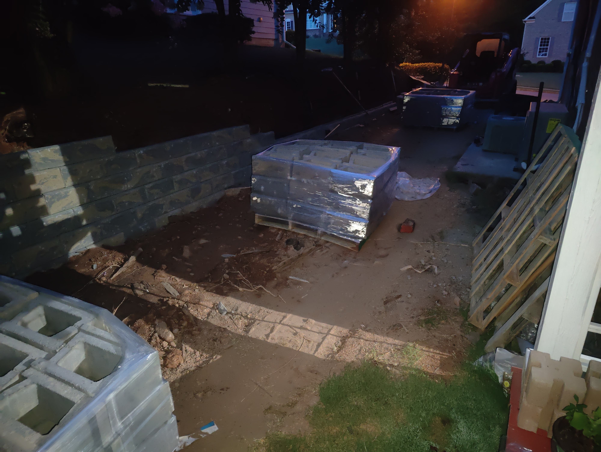

# Retaining Wall build-out and validation

- Wall is aproximatly 100 FT long
- Wal is 5 to 3 feet in height
- Allan Block / AB collection 8”x18”x12”
- #57 stone approximately 14 ton. Filled from top of first course to approximately 8” to 16” below top of wall.
- crusher run approximately 3.5 ton approximately 6” thick
- perforated pipe along base of wall for drainage.  Exits in 3 locations above base block. 

## Construction Images

## Walk through Images

